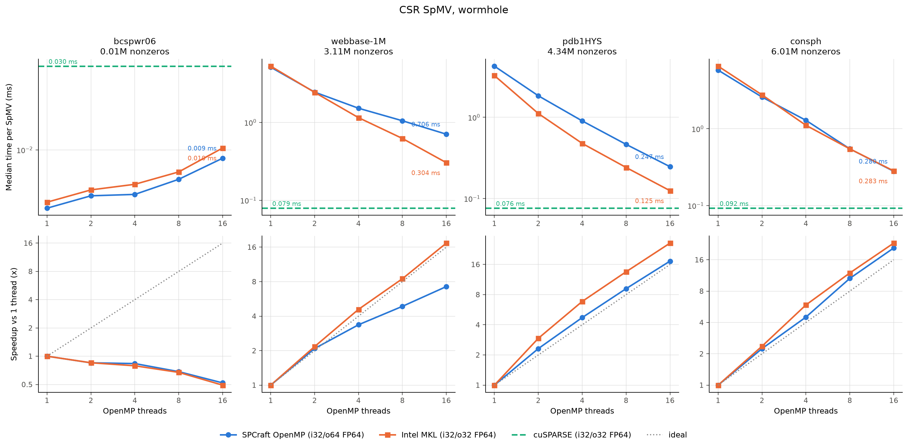

# CSR SpMV, wormhole

| dataset | rows | nonzeros | backend | threads | median ms | GFLOP/s | GB/s | max error vs Eigen |
|---|---:|---:|---|---:|---:|---:|---:|---:|
| bcspwr06 | 1,454 | 5,300 | oneMKL | 1 | 0.0050 | 2.10 | 24.5 | 4.44e-16 |
| bcspwr06 | 1,454 | 5,300 | oneMKL | 2 | 0.0059 | 1.79 | 20.8 | 4.44e-16 |
| bcspwr06 | 1,454 | 5,300 | oneMKL | 4 | 0.0064 | 1.66 | 19.4 | 4.44e-16 |
| bcspwr06 | 1,454 | 5,300 | oneMKL | 8 | 0.0075 | 1.41 | 16.5 | 4.44e-16 |
| bcspwr06 | 1,454 | 5,300 | oneMKL | 16 | 0.0102 | 1.03 | 12.0 | 4.44e-16 |
| bcspwr06 | 1,454 | 5,300 | SPCraft-OpenMP | 1 | 0.0047 | 2.28 | 27.7 | 8.88e-16 |
| bcspwr06 | 1,454 | 5,300 | SPCraft-OpenMP | 2 | 0.0055 | 1.93 | 23.6 | 8.88e-16 |
| bcspwr06 | 1,454 | 5,300 | SPCraft-OpenMP | 4 | 0.0056 | 1.90 | 23.2 | 8.88e-16 |
| bcspwr06 | 1,454 | 5,300 | SPCraft-OpenMP | 8 | 0.0068 | 1.56 | 19.0 | 8.88e-16 |
| bcspwr06 | 1,454 | 5,300 | SPCraft-OpenMP | 16 | 0.0090 | 1.18 | 14.4 | 8.88e-16 |
| bcspwr06 | 1,454 | 5,300 | cuSPARSE | - | 0.0300 | 0.35 | 4.1 | 1.11e-15 |
| webbase-1M | 1,000,005 | 3,105,536 | oneMKL | 1 | 5.2767 | 1.18 | 14.0 | 6.99e-15 |
| webbase-1M | 1,000,005 | 3,105,536 | oneMKL | 2 | 2.4301 | 2.56 | 30.5 | 6.99e-15 |
| webbase-1M | 1,000,005 | 3,105,536 | oneMKL | 4 | 1.1506 | 5.40 | 64.4 | 6.99e-15 |
| webbase-1M | 1,000,005 | 3,105,536 | oneMKL | 8 | 0.6219 | 9.99 | 119.2 | 6.99e-15 |
| webbase-1M | 1,000,005 | 3,105,536 | oneMKL | 16 | 0.3042 | 20.42 | 243.6 | 6.99e-15 |
| webbase-1M | 1,000,005 | 3,105,536 | SPCraft-OpenMP | 1 | 5.1146 | 1.21 | 15.3 | 8.88e-15 |
| webbase-1M | 1,000,005 | 3,105,536 | SPCraft-OpenMP | 2 | 2.4492 | 2.54 | 31.9 | 8.88e-15 |
| webbase-1M | 1,000,005 | 3,105,536 | SPCraft-OpenMP | 4 | 1.5201 | 4.09 | 51.4 | 8.88e-15 |
| webbase-1M | 1,000,005 | 3,105,536 | SPCraft-OpenMP | 8 | 1.0499 | 5.92 | 74.4 | 8.88e-15 |
| webbase-1M | 1,000,005 | 3,105,536 | SPCraft-OpenMP | 16 | 0.7059 | 8.80 | 110.7 | 8.88e-15 |
| webbase-1M | 1,000,005 | 3,105,536 | cuSPARSE | - | 0.0792 | 78.40 | 935.5 | 6.44e-15 |
| pdb1HYS | 36,417 | 4,344,765 | oneMKL | 1 | 3.2646 | 2.66 | 26.8 | 1.99e-13 |
| pdb1HYS | 36,417 | 4,344,765 | oneMKL | 2 | 1.1138 | 7.80 | 78.4 | 1.99e-13 |
| pdb1HYS | 36,417 | 4,344,765 | oneMKL | 4 | 0.4773 | 18.20 | 183.0 | 1.99e-13 |
| pdb1HYS | 36,417 | 4,344,765 | oneMKL | 8 | 0.2414 | 36.00 | 361.8 | 1.99e-13 |
| pdb1HYS | 36,417 | 4,344,765 | oneMKL | 16 | 0.1250 | 69.51 | 698.5 | 1.99e-13 |
| pdb1HYS | 36,417 | 4,344,765 | SPCraft-OpenMP | 1 | 4.2612 | 2.04 | 20.5 | 2.98e-13 |
| pdb1HYS | 36,417 | 4,344,765 | SPCraft-OpenMP | 2 | 1.8410 | 4.72 | 47.5 | 2.98e-13 |
| pdb1HYS | 36,417 | 4,344,765 | SPCraft-OpenMP | 4 | 0.9026 | 9.63 | 96.9 | 2.98e-13 |
| pdb1HYS | 36,417 | 4,344,765 | SPCraft-OpenMP | 8 | 0.4644 | 18.71 | 188.3 | 2.98e-13 |
| pdb1HYS | 36,417 | 4,344,765 | SPCraft-OpenMP | 16 | 0.2468 | 35.21 | 354.5 | 2.98e-13 |
| pdb1HYS | 36,417 | 4,344,765 | cuSPARSE | - | 0.0762 | 114.08 | 1146.5 | 1.99e-13 |
| consph | 83,334 | 6,010,480 | oneMKL | 1 | 6.5370 | 1.84 | 18.5 | 2.18e-11 |
| consph | 83,334 | 6,010,480 | oneMKL | 2 | 2.7646 | 4.35 | 43.8 | 2.18e-11 |
| consph | 83,334 | 6,010,480 | oneMKL | 4 | 1.1103 | 10.83 | 109.2 | 2.18e-11 |
| consph | 83,334 | 6,010,480 | oneMKL | 8 | 0.5473 | 21.96 | 221.5 | 2.18e-11 |
| consph | 83,334 | 6,010,480 | oneMKL | 16 | 0.2827 | 42.52 | 428.7 | 2.18e-11 |
| consph | 83,334 | 6,010,480 | SPCraft-OpenMP | 1 | 5.8038 | 2.07 | 20.9 | 2.18e-11 |
| consph | 83,334 | 6,010,480 | SPCraft-OpenMP | 2 | 2.5885 | 4.64 | 47.0 | 2.18e-11 |
| consph | 83,334 | 6,010,480 | SPCraft-OpenMP | 4 | 1.2894 | 9.32 | 94.3 | 2.18e-11 |
| consph | 83,334 | 6,010,480 | SPCraft-OpenMP | 8 | 0.5477 | 21.95 | 221.9 | 2.18e-11 |
| consph | 83,334 | 6,010,480 | SPCraft-OpenMP | 16 | 0.2797 | 42.98 | 434.6 | 2.18e-11 |
| consph | 83,334 | 6,010,480 | cuSPARSE | - | 0.0925 | 129.99 | 1310.7 | 1.46e-11 |
