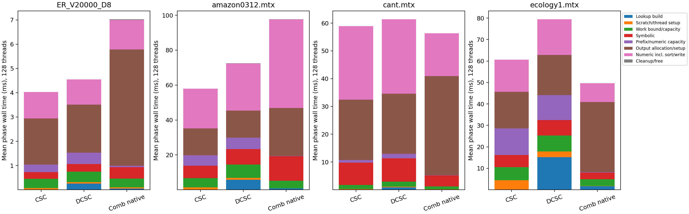

# SpGEMM bottlenecks: measured phases and controlled changes

This report describes the earlier source snapshot recorded by job 8166903. The
subsequent native-tuple implementation applies its dense-column lookup finding
and replaces the large serial output-prefix pass with a checked block scan.
See the [completed native-tuple comparison](columns-bigred-8168162/report.md)
and the [source-level mapping](../../../combblas/SourceMapping.md).

**The main targets differ by workload.** On ecology1, unnecessary DCSC lookup
and serial prefix/capacity processing dominate the gap at high thread counts.
On cant, the column scheduling policy is the strongest measured target.
The earlier matched-output comparison also selected a slow serial CombBLAS
conversion wrapper; that baseline issue has now been corrected.

The primary phase run is BigRed job **8166903**, completed `0:0` in 7:42 on
exclusive CPU-debug node `nid0639`. The conversion follow-up is job **8166911**,
completed `0:0` in 0:56 on `nid0640`. Both used one MPI rank, GNU 14.2 Release,
OpenMP bound to cores, FP64/int32, and the same pinned CombBLAS checkout
`2381a1f7a028b9f56d8531c0b7b157ae2ab27572`. Production SpGEMM kernels were not
changed by this profiling work.

## Each step at 128 threads

These are **mean wall-clock milliseconds** from the coarse instrumentation;
means make the phase contributions additive. Each coarse run is accompanied
by uninstrumented controls in the same executable. CombBLAS's work and symbolic
routines also construct auxiliary data internally; those costs stay in their
respective phases, rather than the outer lookup row.

| Step | ecology1 SpCraft DCSC | ecology1 Comb native | cant SpCraft DCSC | cant Comb native |
|---|---:|---:|---:|---:|
| Outer lookup construction | 15.245 | 1.704 | 0.906 | 0.088 |
| Scratch/thread setup | 2.626 | 0.060 | 0.207 | 0.055 |
| Work estimation/capacity | 7.380 | 3.089 | 1.848 | 1.080 |
| Symbolic | 7.174 | 3.083 | 8.348 | 3.958 |
| Prefix/numeric capacity | 11.700 | 0.324 | 1.649 | 0.090 |
| Output allocation/setup | 18.727 | 32.604 | 21.638 | 35.650 |
| Numeric, including sort/write | 16.567 | 8.805 | 26.746 | 15.373 |
| Cleanup and free | 0.007 | 0.030 | 0.003 | 0.026 |
| **Total** | **79.427** | **49.699** | **61.346** | **56.320** |

## ecology1: serial metadata is the first target

The outer lookup and prefix/capacity differences contribute **24.917 ms** of
an overall **29.728 ms** gap: approximately **84%** of the net difference.
Numeric execution is also slower, but these serial costs are the first targets.

The code explains the scaling problem:

- [mtSpGEMMColumn.h:60–80](../../../../include/kernel/mtSpGEMMColumn.h)
  constructs the auxiliary array serially. ecology1 has `nzc == n == 1,000,000`.
  Its bucket width is one, yet the loop performs roughly two million unsigned
  divisions/comparisons to build a mapping that can be derived directly.
  Lookup construction stays near 14 ms even at one thread and rises to 15.2 ms
  at 128 threads; extra workers do not parallelize it.
- [Lines 90–100](../../../../include/kernel/mtSpGEMMColumn.h) perform division,
  auxiliary indexing, and binary search for every left-column lookup in all
  three passes. When `nzc==n`, sorted unique column IDs imply `col_id[k]==k`,
  so direct `col_ptr[k]` indexing is exact.
- [Lines 215–225](../../../../include/kernel/mtSpGEMMColumn.h) build checked
  prefixes and numeric capacities in one serial loop. On ecology1 it takes
  2.38 ms at one thread, 4.73 ms at 16, and 11.70 ms at 128. This is a measured
  serial-pass scaling problem. Cache/NUMA ownership effects are plausible, but
  these clocks do not establish their hardware-level contribution.

A diagnostic that bypasses lookup only when `nzc==n` lowers the uninstrumented
median total from **79.015 to 59.048 ms** at 128 threads. This isolates a real,
avoidable lookup cost; it is not merely an inference from a timer label.

The four serial metadata/allocation regions together consume about **48.3 ms**
of the 79.4 ms coarse call. Optimizing only the multiply/hash loop cannot remove
that scaling limit.

## cant: scheduling matters more than lookup

At 128 threads, the main unfavorable phase differences are numeric execution
(**11.373 ms**) and symbolic execution (**4.390 ms**). Our cheaper output
allocation offsets much of those differences in the total. The outer lookup
is under one millisecond, so it is not cant's dominant problem.

The diagnostic changes only the three dynamic schedules to static schedules:

| Input, 128 threads | Original median ms | Direct lookup ms | Static schedule ms | Both ms |
|---|---:|---:|---:|---:|
| ecology1 | 79.015 | 59.048 | 63.893 | 51.451 |
| cant | 60.665 | 55.020 | 44.152 | 43.961 |
| amazon0312 | 72.072 | 54.768 | 104.777 | 87.308 |

On cant, static scheduling reduces total time by **27.2%**. Adding the direct
lookup shortcut changes little further. This makes column assignment and its
execution/memory-access consequences the strongest measured target. It does
not identify queue traffic versus cache placement separately.

**Do not switch every matrix to static scheduling.** It makes amazon0312 much
slower. An independent structural-work calculation explains the load-balance
risk: the heaviest contiguous static block at 128 threads has **4.32×** the
mean scalar-product count on amazon0312, versus **1.032×** on cant and **1.001×**
on ecology1. Work is computed as
`work[j] = sum(nnz(A[:,k]) for k stored in B[:,j])`; it excludes sorting and
allocation, so it is a structural load indicator rather than a complete cost
model. [Raw work distribution](phases-bigred-8166903/work-distribution.csv)
and [reproduction script](../../../combblas/scripts/column_work_distribution.py)
are retained.

The sampled numeric experiment at 16 threads attributes about 71% of cant's
SpCraft sampled active time to lookup/multiply/hash and 24% to sorting.
CombBLAS is similar (64% hashing, 25% sorting, with lookup separate).
These shares help locate work inside numeric execution, but are not additive
wall-time fractions. High-thread sampled shares can be distorted by stalls
or preemption; the scheduling conclusion rests on the uninstrumented diagnostic.

## The comparison wrapper had a separate bottleneck

Our old `SpDCCols(*tuples, false)` call selects the **serial** constructor in
`SpDCCols.cpp:110–191`. It scans the tuple array to count columns, copies every
row/value, then scans again to build column headers. CombBLAS also supplies a
parallel five-argument constructor at lines 199–303, which partitions these
operations across OpenMP workers using temporary arrays.

Direct conversion-region medians from job 8166911:

| Input | Threads | Serial conversion ms | Parallel conversion ms |
|---|---:|---:|---:|
| ecology1 | 16 | 48.724 | 20.754 |
| ecology1 | 128 | 83.979 | 1.684 |
| cant | 16 | 64.562 | 25.972 |
| cant | 128 | 73.917 | 5.606 |

Both constructors produced identical offsets, column IDs, rows, and values.
The parallel constructor uses additional temporary storage proportional to
output nnz. The [primary benchmark wrapper](../../../combblas/SpGEMMColumnBenchmark.cpp)
now selects this parallel overload. Historical job 8165879 is labeled as using
the serial wrapper; its matched-output advantage must not be presented as a
hash-kernel advantage or as a result against efficient parallel conversion.

The conversion follow-up ran on a different node from the phase job. Native
multiplication times also differed substantially between serial/parallel
rounds, especially at 128 threads, so these conversion medians must not be
added to another job's native median to invent a corrected end-to-end result.
The corrected wrapper passed independent Eigen checks on rectangular products
in both precisions and index widths, and on an empty product. The full seven-input
end-to-end suite has not been rerun after that wrapper correction.

## Optimization order supported by this evidence

1. Add an exact fully-populated-column shortcut and remove repeated division
   from generic auxiliary construction where possible, while preserving huge
   dimension/overflow behavior.
2. Parallelize checked prefix/capacity preparation without weakening overflow
   checks or introducing worker exception handling.
3. Improve scheduling for balanced, short-column workloads while retaining
   load balancing for inputs like amazon0312. Global static scheduling is not
   supported by these results.
4. Re-profile allocation/output materialization after those changes. Hash-table
   redesign is not the first target indicated by the ecology1 profile.

Only the comparison wrapper was corrected in this task. Lookup and scheduling
variants remain isolated benchmark experiments; the production kernels retain
their previously audited behavior.

## Validation and measurement limits

- Job 8166903 verified original, instrumented, and diagnostic paths against
  Eigen before timing at every thread count. There were 12 rounds per
  configuration except the time-capped single-thread cant (3) and amazon (4).
- All raw wall-phase sums reconcile with their measured total within the
  analysis tolerance (10 microseconds or 0.1%). No negative or nonfinite phase
  durations were accepted.
- At 128 threads the DCSC coarse/control median ratios were 1.005 for ecology1,
  0.996 for cant, and 1.013 for amazon. ER8's ratio was 1.133; cant also showed
  about 10–11% perturbation at one and 16 threads. Those configurations should
  not be used for fine-grained absolute attribution without that qualification.
- The first job, 8166894, completed ecology1 and then stopped because its new
  verifier used a different per-entry tolerance. The final profiler uses the
  existing benchmark's norm-scaled FP64 criterion and records the maximum error.
  On cant's rejected entry 247, production and profiled results both equaled
  `-8.773205699064192e-11`; Eigen gave `-6.184563972055912e-11` and the independent
  long-double accumulation gave `-6.631672988532955e-11`. All lie within the
  conservative rounding bound `9.546111435848711e-9` for 31 products whose
  absolute magnitudes sum to `693417.15976330475`. Maximum full-matrix absolute
  verification error was `3.725290298461914e-9`.
- Native upstream sources were not modified. Their previously documented
  numThreads races remain; this work does not claim to make them race-free.
- The profile uses wall clocks and sampled active durations, not hardware
  counters. It establishes expensive phases and the effect of controlled
  changes, without claiming specific cache-miss or NUMA-stall rates.

[Full phase report](phases-bigred-8166903/PhaseReport.md),
[phase CSV](phases-bigred-8166903/phase-summary.csv),
[conversion report](conversion-bigred-8166911/ConversionReport.md),
[profiling method and commands](../../../combblas/PhaseProfiling.md), and
[source-derived instrumentation generator](../../../combblas/scripts/generate_phase_kernels.py).
