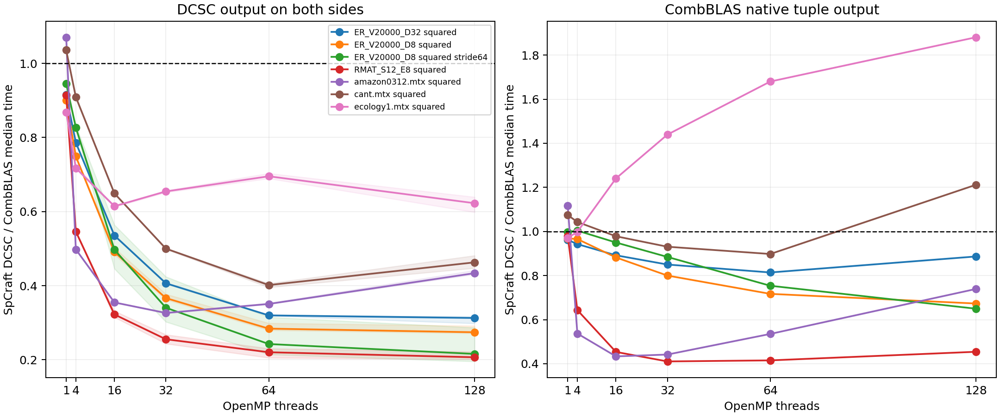

# Native CSC/DCSC SpGEMM on BigRed

**Updated after phase profiling:** this historical job used CombBLAS's serial
tuple-to-DCSC constructor. Its matched-output advantage includes an avoidable
wrapper cost; it does not establish an advantage over parallel compression.
The benchmark now selects the parallel constructor. See the
[bottleneck analysis](Bottlenecks.md) for phase timings and the controlled
serial/parallel conversion comparison. Native tuple timings below remain valid
for this historical run.

Job **8165879** completed successfully (`COMPLETED`, exit `0:0`) in **11:02** on CPU debug node `nid0639`. This replaces the earlier CSR/transposed-DCSC experiment as the primary comparison. It uses an exclusive two-socket AMD EPYC 7742 node, 128 physical cores, one MPI rank, GNU C++ 14.2 through the Cray wrapper, and Release builds. CombBLAS is unmodified at `2381a1f7a028b9f56d8531c0b7b157ae2ab27572`.

## What changed

SpCraft now has a native CSC hash SpGEMM overload and a move-only `DcscMatrix<IT,NT,OT>` with a native DCSC hash overload. Both have separate symbolic and numeric phases, power-of-two flat tables, linear probing, checked offsets, sorted rows, and semiring operations. Neither kernel uses try/catch or unordered containers. DCSC stores only nonempty column headers and uses a compressed bucket lookup rather than logical-width CSC offsets.

Every backend computes **A*B directly by column expansion**, using identical canonical input entries. Input conversion and Eigen verification are outside timing. All timed calls include symbolic/numeric work, sorting, allocation, and output destruction.

The primary comparison returns DCSC on both sides. CombBLAS LocalSpGEMMHash produces tuples, so its DCSC path additionally times its own SpDCCols conversion and tuple destruction. Native tuple time is also measured independently. This exposes conversion cost instead of attributing it to the hash kernel.

## Median time at 128 threads

All seven products use FP64 and int32 indices/offsets. Ratios below one favor SpCraft. The thread sweep is 1,4,16,32,64,128, with three warmup rounds and up to 20 measured rounds per configuration (45-second cap). Four-backend order is balanced over each four-round cycle.

| Input | SpCraft CSC ms | SpCraft DCSC ms | CombBLAS tuples ms | CombBLAS DCSC ms | DCSC / Comb DCSC | DCSC / Comb tuples |
|---|---:|---:|---:|---:|---:|---:|
| amazon0312.mtx squared | 53.447 | 67.651 | 91.513 | 155.914 | 0.434 | 0.739 |
| cant.mtx squared | 55.959 | 59.000 | 48.688 | 127.412 | 0.463 | 1.212 |
| ecology1.mtx squared | 56.276 | 74.308 | 39.508 | 119.337 | 0.623 | 1.881 |
| ER_V20000_D32 squared | 44.045 | 45.025 | 50.788 | 143.873 | 0.313 | 0.887 |
| ER_V20000_D8 squared | 3.472 | 3.768 | 5.599 | 13.733 | 0.274 | 0.673 |
| ER_V20000_D8 squared stride64 | 22.515 | 4.064 | 6.257 | 18.817 | 0.216 | 0.650 |
| RMAT_S12_E8 squared | 5.495 | 5.210 | 11.469 | 25.177 | 0.207 | 0.454 |

At 128 threads SpCraft has lower median time on all seven inputs when both sides return DCSC. Against native tuple output it is slower on **cant (21.2%)** and **ecology1 (88.1%)**. At 16 threads, the ecology1 gap against native tuples is 24.0%; cant is approximately at parity. Output compression accounts for a substantial part of the advantage in the matched-output comparison, so these are not claims of uniformly faster hash phases.

The hypersparse case embeds an ER graph of 20,000 vertices into a 1,280,000-by-1,280,000 shape with 64-fold ID spacing. It retains the original scalar products and values. At 128 threads the CSC implementation takes 22.515 ms and DCSC takes 4.064 ms: **5.54× lower time** for DCSC in this case. This directly exercises the benefit of avoiding headers and loop iterations for empty logical columns.

Equal formats and orientation remove the original comparison mismatch, but implementations still differ in auxiliary lookup construction/reuse, symbolic bounds, scratch allocation, scheduling, checked prefixes, and direct compressed output. The [source audit](../../../combblas/ColumnCorrectnessAudit.md) records those differences. Phase-level profiling would be required to assign residual runtime gaps to individual mechanisms.

## Correctness and variability

All 13 local Debug/ASan tests passed. The new container and column-kernel tests also passed with Clang/OpenMP and GCC serial builds under address/undefined-behavior sanitizers. Additional tests cover bucket gaps, missing keys inside populated buckets, maximum signed/unsigned dimensions, default/structural empties, and negative dimensions. The BigRed job passed both new test executables before measurement.

The driver checked every output column/offset, row index, and value against Eigen at each thread count. All configurations passed; maximum absolute error was 3.72529e-09, within the scaled FP64 tolerance. Separate local rectangular tests passed in FP32/FP64 and int32/int64 at one and four threads; an empty rectangular product and hypersparse smoke case passed as well. The example compiled and printed the hand-computed product.

The [line-by-line audit](../../../combblas/ColumnCorrectnessAudit.md) covers every executable block of the container and column kernel, including ownership and failure preservation, terminal-offset sizing, integer auxiliary buckets, absent columns, full-table probing termination, semiring operand order, compaction, output-column removal, and OpenMP ownership. The same audit states the valid-input and nonthrowing-semiring contract.

Timing variation remains measurable: at 128 threads, SpCraft DCSC CV ranges from 3.7% to 18.8%. The full report includes all four CV values, sample counts, and paired bootstrap confidence intervals. They describe within-allocation sampling, not variation across independent jobs. The unmodified upstream shared-variable race hazards remain documented; matching numerical results does not establish that upstream is race-free.

## Artifacts

- [Full report](columns-bigred-8165879/report.md), [CSV](columns-bigred-8165879/summary.csv), and [PDF figure](columns-bigred-8165879/comparison.pdf).
- [Commands, topology, OpenMP environment, and binary hash](columns-bigred-8165879/metadata.json).
- [Source checksums](columns-bigred-8165879/source-sha256.txt) identify the headers and driver measured in this historical job; the driver's output conversion has since been corrected.
- Seven adjacent JSON files retain every timing sample and verification error.
- [Build/run instructions](../../../combblas/README.md), [CPU debug script](../../../combblas/slurm/spgemm_columns.sbatch), and [library example](../../../../examples/spcraft/e03_column_spgemm.cpp).
- [Earlier CSR results](README.md) remain historical; their transposed orientation and output formats differ from this experiment.

Measured executable SHA256: `e56cd432501541af74e3c871558f6d76191d370fbdd50adf1260d159350542fd`.
