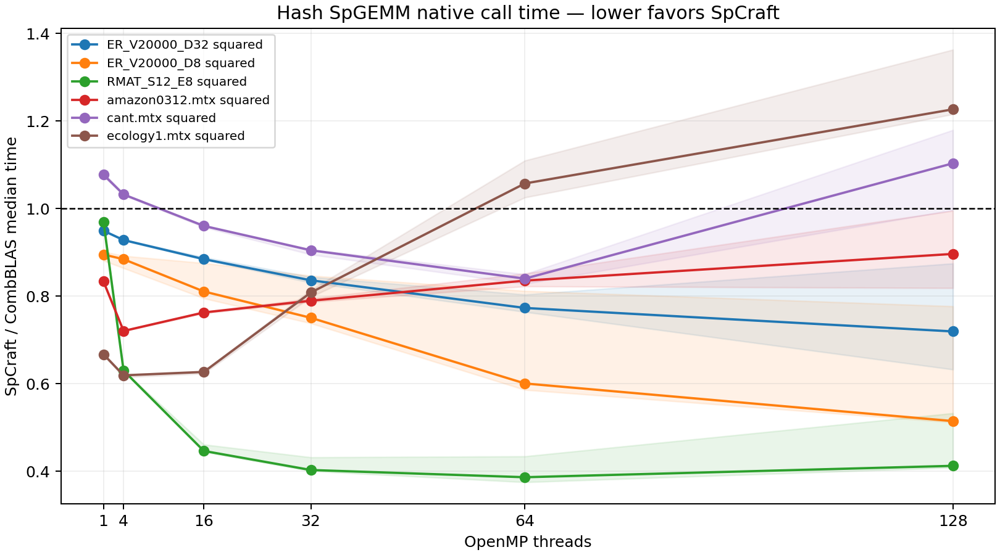

# Hash SpGEMM results on BigRed

This is the earlier CSR/transposed-DCSC experiment. The primary comparison is
now the [native CSC/DCSC implementation and BigRed results](ColumnResults.md).

Job **8165816** completed with exit status **0:0** in 13 minutes on CPU debug node `nid0639`. The allocation was exclusive: two AMD EPYC 7742 sockets, 128 physical cores, eight NUMA domains, one MPI rank, and no SMT workers. Both kernels were instantiated in the same Release executable using GNU C++ 14.2 through the Cray compiler wrapper. CombBLAS was unmodified at commit `2381a1f7a028b9f56d8531c0b7b157ae2ab27572`.

The final kernel uses separate symbolic and numeric flat hash tables with power-of-two capacities, multiplier 107, and linear probing. It has no `try`/`catch` or unordered containers. Relative to the first flat-hash baseline, the final version batches dynamic row scheduling adaptively and fixes two allocation-sizing checks identified by source review.

## Final comparison

All six products are A² with FP64 values and matching int32 indices/offsets. The full sweep is 1, 4, 16, 32, 64, and 128 threads. Each configuration has three warmup pairs and up to 21 alternating AB/BA measurement pairs, capped at 45 seconds. Both complete native calls include symbolic work, numeric work, sorting, output allocation, and destruction. Input conversion and independent Eigen verification are excluded. Output formats remain CSR for SpCraft and sorted tuples for CombBLAS.

Ratios below one favor SpCraft. These are measured ratios of medians; see the full report for paired bootstrap intervals and sample counts.

| Input | Ratio at 16 threads | SpCraft ms at 128 | CombBLAS ms at 128 | Ratio at 128 |
|---|---:|---:|---:|---:|
| amazon0312.mtx squared | 0.763 | 54.694 | 61.007 | 0.897 |
| cant.mtx squared | 0.961 | 60.358 | 54.696 | 1.104 |
| ecology1.mtx squared | 0.627 | 62.142 | 50.651 | 1.227 |
| ER_V20000_D32 squared | 0.885 | 45.606 | 63.393 | 0.719 |
| ER_V20000_D8 squared | 0.811 | 3.564 | 6.926 | 0.515 |
| RMAT_S12_E8 squared | 0.446 | 5.239 | 12.704 | 0.412 |

The final implementation is faster on all six inputs at 16 threads. At 128 threads, `cant` is 10.4% slower and `ecology1` is 22.7% slower; the other four have lower median times. The `cant` ratio interval includes parity (0.996–1.180), while the `ecology1` interval is 1.216–1.363. More threads are not always faster: ecology1 reaches its lowest sampled SpCraft time at 16 threads.

Runtime variation is separate from the gap between implementations. At 128 threads, SpCraft CV ranges from 4.1% to 10.9%, and CombBLAS CV from 5.4% to 22.5%. These measurements support workload-specific conclusions, not negligible noise or universal performance parity. The intervals describe this allocation and sample; they do not establish reproducibility across independent jobs.

## Effect of the changes

The first flat-hash version used `schedule(dynamic, 1)`. The final version uses `max(1, min(256, rows / max_threads / 32))`, amortizing scheduling for large row counts while retaining smaller chunks on short, irregular inputs. The same job built and measured both versions. Baseline and final suites ran sequentially, so changes in the measured CombBLAS control must also be considered.

| Input, 128 threads | Original SpCraft ms | Final SpCraft ms | Original ratio | Final ratio |
|---|---:|---:|---:|---:|
| amazon0312.mtx squared | 93.419 | 54.694 | 1.161 | 0.897 |
| cant.mtx squared | 87.615 | 60.358 | 1.469 | 1.104 |
| ecology1.mtx squared | 166.221 | 62.142 | 3.224 | 1.227 |
| ER_V20000_D32 squared | 45.859 | 45.606 | 0.670 | 0.719 |
| ER_V20000_D8 squared | 5.225 | 3.564 | 0.663 | 0.515 |
| RMAT_S12_E8 squared | 5.644 | 5.239 | 0.448 | 0.412 |

The largest observed improvement is ecology1: 166.221 → 62.142 ms at 128 threads. Matching the hash function does not eliminate differences in CSR versus DCSC traversal, symbolic capacity bounds, scratch reuse, prefix construction, scheduling, and output storage. These code differences explain why parity is not guaranteed; phase-level profiling would be needed to attribute the residual gaps quantitatively.

## Correctness evidence

The [source audit](../../../combblas/CorrectnessAudit.md) covers every executable block of the production kernel and reviews the upstream hash path and comparison driver. It found and fixed premature narrowing of row scratch sizes and a missing vector capacity limit. It documents probing termination even at full occupancy, valid sentinel selection, duplicate and semiring semantics, in-place compaction, disjoint row writes, and checked output prefixes. It also records upstream signed-overflow and shared-variable race hazards; the upstream checkout was left unchanged.

The full local Debug/ASan suite passed all 11 tests. The dedicated SpGEMM test also passed with Clang/OpenMP and GCC without OpenMP under address/undefined-behavior sanitizers, and inside the BigRed job. Tests include Boolean OR-AND, min-plus, noncommutative multiplication, empty products, duplicates, wraparound collision chains, large keys, exact-limit offsets, and allocation/offset overflow. Separate rectangular benchmark checks passed for FP32/FP64 and int32/int64 at one and four threads.

Every measured configuration passed full output-pattern and value comparison with Eigen before timing. The largest absolute error in the final suite was 3.72529e-09, within the scaled FP64 tolerance. Timing samples check output nnz; they do not repeat full value verification inside the clock.

## Artifacts and reproduction

- [Final full report](bigred-8165816/current/report.md), [CSV](bigred-8165816/current/summary.csv), and [PDF figure](bigred-8165816/current/comparison.pdf).
- [Original full report](bigred-8165816/baseline/report.md) and [CSV](bigred-8165816/baseline/summary.csv).
- Each directory retains six JSON files with per-iteration samples and compiler metadata, plus `metadata.json` with commands, binary SHA256, OpenMP environment, and node topology.
- [Build instructions](../../../combblas/README.md) and [CPU debug submission script](../../../combblas/slurm/spgemm.sbatch).
- [Baseline-to-current patch](bigred-8165816/baseline-to-current.patch) preserves the exact original header relative to the reviewed final header; the submission script expects that original header as `snapshots/mtSpGEMM-baseline.h`.
- `local/baseline` and `local/batched32` are exploratory VM measurements. The fixed-32 version is an intermediate experiment, not the final adaptive kernel, and those times should not be pooled with BigRed.

Provenance (SHA256):

| Artifact | SHA256 |
|---|---|
| Final kernel | `c1b37af7d6fccf8be113be04cab093c9625382da5c5dcf37a6ee2d6d82c61326` |
| Original kernel | `f27d0153f72370a56ff0e18b9254fcc8ae37b7483da23ed7a4867dc7ec7c7d89` |
| baseline binary | `1b0ee1358948c4fb3a73045f3ac54f6ce43d44f9799392091cfd0e6379684f3f` |
| current binary | `22986e9d896e2405d8a2c6f12c3c4fcbdd40bbe326bd777046ab32be862ffc90` |
| amazon0312.mtx | `c97ac1b7b87897c419445b72b765dcb1c5f368cbf5823311c4556a873bf69915` |
| cant.mtx | `67556f4af0534ba28c283d788530fada209f3994d448dbc189ef40b91e87486d` |
| ecology1.mtx | `0135990b04b925d6dda6a416106ac6b38138c6069734812e4465523279d174e7` |
